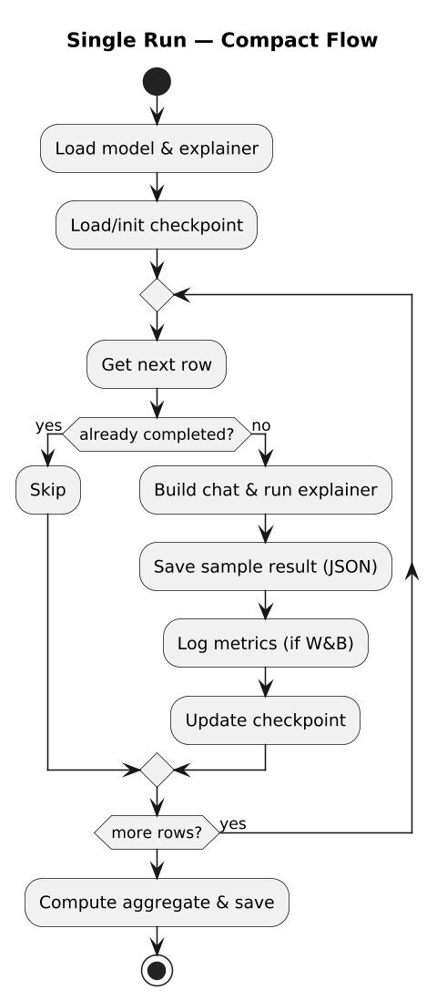
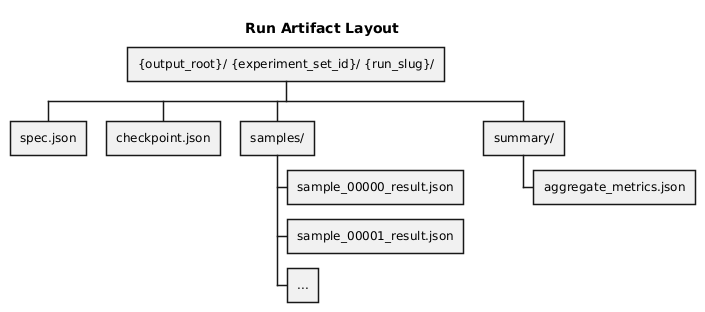
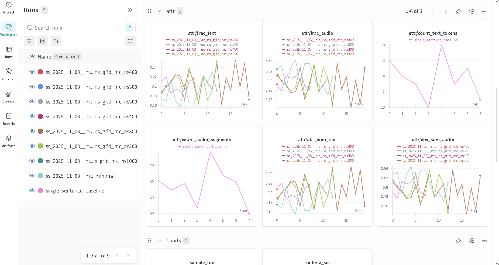

🧪 Experiments Runner
=====================

Overview ✨
-----------

``mllm_shapx`` is the configuration-driven experiment runner used in this monorepo to
execute reproducible SHAP runs (exact and sampling-based) over curated dataset shards.
It focuses on:

- Loading dataset shards (Hugging Face datasets)
- Expanding a JSON config into a sweep of concrete runs
- Executing each run with checkpoint/resume support
- Writing structured artifacts to disk
- Optional Weights & Biases logging + artifact upload

Below is a diagram showing DAG of runner operation:

Where it lives 📍
-----------------

In this repository, the code lives under:

- ``experiments/mllm_shapx/``

The CLI entrypoint is:

- ``python -m mllm_shapx.cli``

Environment / setup ⚙️
----------------------

The runner is designed to work in the monorepo environment.

Preferred setup path:

.. code-block:: bash

   make install

If you run ``mllm_shapx`` without installing the ``mllm_shap`` package into the active
environment, set ``MLLM_SHAP_SRC`` to point at the package sources so imports resolve:

.. code-block:: bash

   export MLLM_SHAP_SRC=../../mllm_shap/src
   export LOG_LEVEL=INFO

A minimal example environment file is provided at:

- ``experiments/mllm_shapx/.example.env``

Running the CLI 🧰
------------------

Validate a config
^^^^^^^^^^^^^^^^^

.. code-block:: bash

   python -m mllm_shapx.cli validate --config experiments/mllm_shapx/configs/mc_minimal.json

Optionally, validate and also test that the dataset shard can be fetched/read:

.. code-block:: bash

   python -m mllm_shapx.cli validate \
     --config experiments/mllm_shapx/configs/mc_minimal.json \
     --check-dataset

Run experiments
^^^^^^^^^^^^^^^

.. code-block:: bash

   python -m mllm_shapx.cli run --config experiments/mllm_shapx/configs/mc_minimal.json

Resume an interrupted run
^^^^^^^^^^^^^^^^^^^^^^^^^

Resume uses per-run ``checkpoint.json`` plus the presence of already-written sample
results on disk:

.. code-block:: bash

   python -m mllm_shapx.cli run \
     --config experiments/mllm_shapx/configs/mc_minimal.json \
     --resume

Batching multiple configs
^^^^^^^^^^^^^^^^^^^^^^^^^

A helper script exists for sequential runs with retry and logging:

- ``experiments/mllm_shapx/run_configs.sh``

For cluster execution, the repository includes Slurm wrappers under:

- ``experiments/run_mllm_shapx.sbatch``
- ``experiments/run_mllm_shapx_exact.sbatch``

Outputs and artifacts 📦
------------------------

For each expanded (concrete) run, ``mllm_shapx`` creates a run directory:

Key files:

- ``spec.json``: fully-resolved configuration for the concrete run (after sweep expansion)
- ``checkpoint.json``: resume state (completed indices, next index)
- ``samples/*.json``: per-row serialized results (attributions + metadata)
- ``summary/aggregate_metrics.json``: run-level aggregates (runtime and attribution summaries)

Configuration model (high level) 🧭
-----------------------------------

The runner parses a JSON config into an ``ExperimentSet`` dataclass (see
``experiments/mllm_shapx/config.py``). At a high level:

- Top-level includes ``experiment_set_id``, ``output_root``, ``connector``, ``device``
- ``dataset`` selects the dataset repo/subset/split and loading knobs (parquet, trust_remote_code)
- ``selection`` controls which rows to process (start index, max samples, shuffle seed)
- ``modality`` controls input/output modality combinations
- ``shap`` chooses the SHAP mode + embedding similarity + reducer + normalizer
- ``experiments`` is a list of variants; each variant may expand into many runs (sweeps)

Important enums (authoritative)
^^^^^^^^^^^^^^^^^^^^^^^^^^^^^^^

See ``experiments/mllm_shapx/constants.py``:

- Explainers: ``exact``, ``limited_mc``, ``standard_mc``, ``limited_cc``, ``standard_cc``,
  ``limited_neyman``, ``standard_neyman``, ``hierarchical``
- Connectors: ``liquid_audio`` (LiquidAudio), ``hf_text`` (Transformers text-only)
- Similarities: ``CosineSimilarity``, ``TfIdfCosineSimilarity``, ``EuclideanSimilarity``
- Modes: ``CONTEXTUAL`` and ``STATIC``
- Dataset subsets: ``single_sentence``, ``multi_lingual``, ``multi_sentence``

Weights & Biases integration 📊
-------------------------------

If enabled in the config, W&B logging is initialized once per run and:

- logs per-sample metrics during execution
- uploads summary JSON and (optionally) sample directories as artifacts

An example of a run logged to W&B:

Troubleshooting 🛠️
------------------

- Import errors for ``mllm_shap``: set ``MLLM_SHAP_SRC`` or install the package into the environment.
- Stuck/partial runs: use ``--resume``; to restart cleanly remove the run’s ``checkpoint.json``.
- More verbosity: set ``LOG_LEVEL=DEBUG``.
