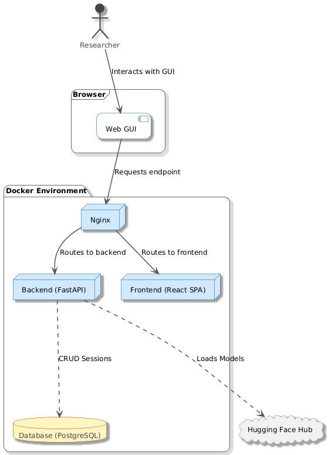
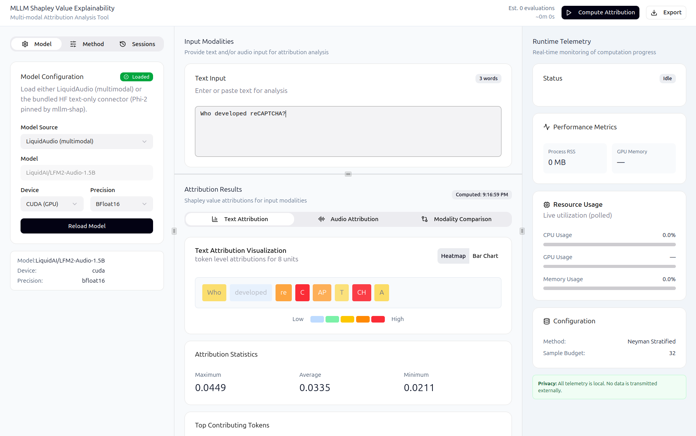
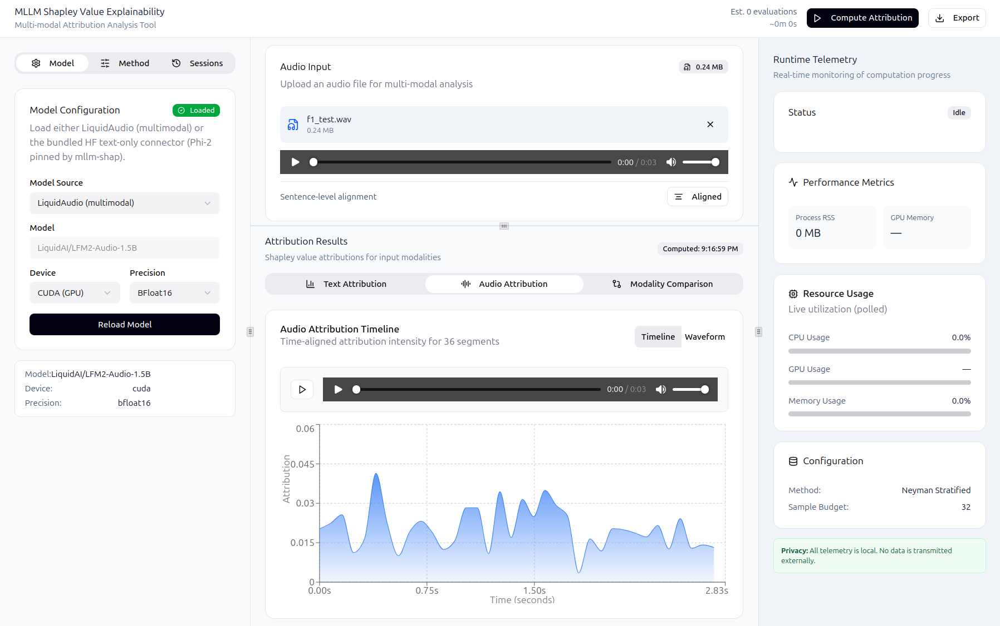

Companion GUI - SHAP Multi-Modal LLM Explainer
==============================================

Overview
--------

Separate repository (https://github.com/mvishiu11/shap-mllm-explainer) contains a companion,
GUI-first application for exploring token-level and audio time-series attributions produced by ``mllm_shap``.

The app is intentionally containerized (Docker Compose) to provide a reproducible,
production-like environment.

Architecture
------------

The stack is composed of:

- **Frontend**: React (Vite build), served by Nginx
- **Backend**: FastAPI
- **Database**: PostgreSQL (stores sessions and configuration snapshots)

This can be seen on the following diagram:

At a high level, the frontend:

- loads a model/connector mode
- accepts text input and optional audio
- triggers explainability jobs
- displays attribution visualizations
- persists and reloads sessions

The backend:

- validates inputs and model state
- runs inference and SHAP computation (via ``mllm_shap``)
- exposes progress/cancel/logs for long-running jobs
- stores sessions in the database

Some examples of the running GUI are shown below:

Running the application (Docker Compose)
---------------------------------------

CPU
^^^

From ``shap-mllm-explainer/``:

.. code-block:: bash

	docker compose up --build

Open the UI:

- ``http://localhost``

GPU (optional)
^^^^^^^^^^^^^^

Prerequisites on the host:

- NVIDIA driver installed and working (``nvidia-smi`` works)
- NVIDIA Container Toolkit configured for Docker

Run:

.. code-block:: bash

	docker compose -f docker-compose.yaml -f docker-compose.gpu.yaml up --build

Quick verification inside the backend container:

.. code-block:: bash

	docker compose exec backend uv run python -c "import torch; print('cuda_available=', torch.cuda.is_available()); print('torch_cuda=', torch.version.cuda)"

Local development (without Docker)
----------------------------------

Backend
^^^^^^^

From ``shap-mllm-explainer/backend/``:

.. code-block:: bash

	uv sync --dev
	uv run uvicorn app.main:app --reload --host 0.0.0.0 --port 8000

Frontend
^^^^^^^^

From ``shap-mllm-explainer/web/``:

.. code-block:: bash

	npm i
	npm run dev

Configuration
-------------

Frontend configuration
^^^^^^^^^^^^^^^^^^^^^^

- ``VITE_API_BASE_URL``: backend base URL (defaults to ``/api``)

Backend configuration
^^^^^^^^^^^^^^^^^^^^^

- ``DATABASE_URL``: async SQLAlchemy URL (Compose uses ``postgresql+asyncpg://...``)
- ``LOG_LEVEL``: log verbosity (e.g. ``INFO`` / ``DEBUG``)
- ``UV_PYTHON``: set in Compose to prevent ``uv`` from downloading another CPython inside the container

Compose files to inspect:

- ``shap-mllm-explainer/docker-compose.yaml``
- ``shap-mllm-explainer/docker-compose.gpu.yaml``

Backend API surface (high level)
--------------------------------

The backend exposes FastAPI routes under the ``/api`` prefix.

General:

- ``GET /health``

ML endpoints (``/api/ml``):

- ``POST /models/load`` — load a supported connector/mode
- ``POST /predict`` — run a prediction (text-only, or text+audio for LiquidAudio mode)
- ``POST /explain`` — start an explainability job (supports text and optional audio)
- ``GET /progress/{job_id}`` — progress reporting
- ``POST /cancel/{job_id}`` — cooperative cancellation
- ``GET /logs/{job_id}`` — retrieve the last log lines from a job
- ``GET /telemetry`` — runtime telemetry (CPU/RAM/process + GPU if available)
- ``GET /diagnostics`` — basic model/device diagnostics

Notes:

- Audio uploads are accepted only when the backend is running in LiquidAudio mode.
- Text-only mode rejects audio requests with a clear 400 response.
