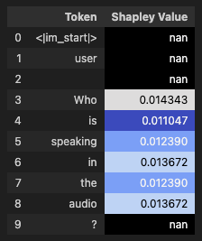
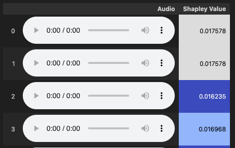
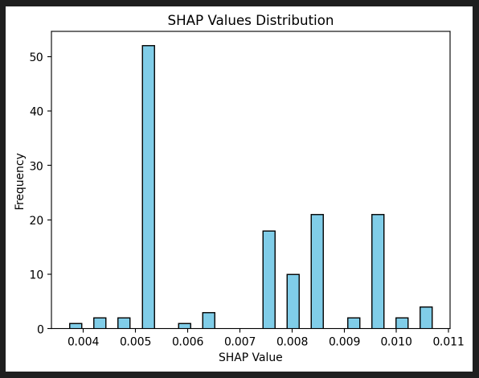

Installation
------------

.. code-block:: bash

   pip install mllm-shap

Basic Text Usage
----------------

Following example demonstrates how to use MLLM-SHAP to explain text generation from a Liquid-Audio model. It features just one user question (2 turns, including system prompt), and calculates SHAP values for user input tokens only, excluding punctuation tokens. Monte Carlo SHAP with minimal number of samples is used for fast approximation of SHAP values (not applicable for production use cases, only for demonstration purposes). Most of commented objects are just to showcase available options, they are not strictly necessary.

.. code-block:: Python

   import torch

   from mllm_shap.connectors import LiquidAudio, ModelConfig
   from mllm_shap.connectors.enums import Role, SystemRolesSetup, ModelHistoryTrackingMode
   from mllm_shap.connectors.filters import ExcludePunctuationTokensFilter

   from mllm_shap.shap import Explainer, McShapExplainer
   from mllm_shap.shap.enums import Mode
   from mllm_shap.shap.embeddings import MeanReducer
   from mllm_shap.shap.similarity import CosineSimilarity
   from mllm_shap.shap.normalizers import PowerShiftNormalizer

   from mllm_shap.utils.jupyter import display_shap_colors_df

   # set device and generation parameters
   device = torch.device("mps") if torch.backends.mps.is_available() else torch.device("cpu") # use GPU if available
   # limit generation to 64 tokens with low temperature
   generation_kwargs = {"max_new_tokens": 64, "model_config": ModelConfig(text_temperature=0.2)}

   # load model and setup explainer
   model = LiquidAudio(device=device, history_tracking_mode=ModelHistoryTrackingMode.TEXT) # track and generate only text history
   shap = McShapExplainer(
      num_samples=-1, # minimal number of samples for Monte Carlo SHAP (one vs all, linear complexity, very poor approximation)
      mode=Mode.CONTEXTUAL, # use contextual embeddings, default
      embedding_reducer=MeanReducer(), # use mean pooling to reduce token embeddings to single embedding per audio, default
      similarity_measure=CosineSimilarity(), # use cosine similarity to compare embeddings, default
      normalizer=PowerShiftNormalizer(power=2.0), # use power-shift normalization with power of 2.0
   )
   explainer = Explainer(model=model, shap_explainer=shap)

   # define chat
   chat = model.get_new_chat(
      system_roles_setup=SystemRolesSetup.SYSTEM_ASSISTANT, # don't calculate SHAP for system and assistant messages
      token_filter=ExcludePunctuationTokensFilter(), # exclude punctuation tokens from shapley values calculation
   )
   # add one system turn
   chat.new_turn(Role.SYSTEM)
   chat.add_text("You are a helpful assistant that answers questions briefly.")
   chat.end_turn()
   # add one user turn
   chat.new_turn(Role.USER)
   chat.add_text("Who are you?")
   chat.end_turn()

   # run explainer
   result = explainer(
      chat=chat,
      verbose=True, # save full history in result.history object
      generation_kwargs=generation_kwargs,
      progress_bar=True, # show progress bar during generation, default
   )

   # extract results
   explained_chat = result.full_chat
   explained_chat_conversation = explained_chat.get_conversation()
   user_entry = explained_chat_conversation[1][0] # extract user entry

   # display results
   display_shap_colors_df(pd.DataFrame(list(zip(user_entry.content, user_entry.shap_values, user_entry.roles)), columns=["Token", "Shapley Value", "Role"]))

This will produce an output similar to the following:

Chat messages can be accessed in the following way:

.. code-block:: Python

   from pprint import pprint

   pprint(chat.get_conversation())

This gives list of turns, each turn has list of messages - `ChatEntry` objects. Each `ChatEntry` contains content_type (audio / text), roles (for each token), SHAP values (if has been calculated), and content - list of strings (text) or bytes (audio), each entry corresponding to one token. All results are returned in same order as input messages / model outputs. Result of the following code will be:

.. code-block:: bash

   [[ChatEntry(content_type=0,
               roles=[2, 2, 2, 2, 2, 2, 2, 2, 2, 2, 2, 2, 2, 2, 2],
               content='<|im_start|>, system, \n, You,  are,  a,  helpful,  assistant,  that,  answers,  questions,  briefly...',
               shap_values=None)],
   [ChatEntry(content_type=0,
               roles=[2, 2, 2, 0, 0, 0, 0, 2, 2],
               content='<|im_start|>, user, \n, Who,  are,  you, ?, <|im_end|>, \n',
               shap_values=None)]]

We can display each turn in prettier way (it is a method of `EntryChat` object, won't display SHAP values though):

.. code-block:: Python

   explained_chat_conversation[1][0].display()

.. code-block:: bash

   <|im_start|> user
   Who are you? <|im_end|>

Working with Audio
------------------

Please refer to `the notebook <https://github.com/Pawlo77/MLLM-Shap/tree/main/examples/audio_external.ipynb>`_ in the official GitHub repository for a complete example of explaining audio inputs and outputs using MLLM-SHAP. Most crushial changes to example above are related to loading audio files, adding audio tokens to chat, and setting up generation parameters for audio models:

.. code-block:: Python

   from mllm_shap.utils.audio import display_audio
   from mllm_shap.utils.jupyter import display_shap_colors_df_audio

   # load audio file
   model = LiquidAudio(device=device, history_tracking_mode=ModelHistoryTrackingMode.AUDIO) # track and generate only audio history
   # it can be also set to TEXT_AUDIO for tracking both text and audio history. Note
   # that this settings corresponds to what model generates, not what is it inputted to it.

   ...

   # add turn of 2 messages - text and audio
   chat.new_turn(Role.USER)
   chat.add_text("Who is speaking in the audio?")
   chat.add_audio(sample_entry["audio__male"][0])
   chat.end_turn()

Printed conversation differs when feed with audio (here for text input, audio output only conversation, different to previous example):

.. code-block:: Python

   pprint(chat.get_conversation())

.. code-block:: bash

   [[ChatEntry(content_type=0,
               roles=[2, 2, 2, 2, 2, 2, 2, 2, 2, 2, 2, 2, 2, 2, 2],
               content='<|im_start|>, system, \n, You,  are,  a,  helpful,  assistant,  that,  answers,  questions,  briefly...',
               shap_values=[nan, nan, nan, nan, nan, nan, nan, nan, nan, nan, nan, nan, nan, nan, nan])],
   [ChatEntry(content_type=0,
               roles=[2, 2, 2, 0, 0, 0, 0, 2, 2],
               content='<|im_start|>, user, \n, Who,  are,  you, ?, <|im_end|>, \n',
               shap_values=[nan, nan, nan, 0.3125, 0.376953125, 0.3125, nan, nan, nan])],
   [ChatEntry(content_type=0,
               roles=[2, 2, 2],
               content='<|im_start|>, assistant, \n',
               shap_values=[nan, nan, nan]),
   ChatEntry(content_type=1,
               roles=[1, 1, 1, 1, 1, 1, 1, 1, 1, 1, 1, 1, 1, 1, 1, 1, 1, 1, 1, 1],
               content='Audio bytes of total length 24624',
               shap_values=[nan, nan, nan, nan, nan, nan, nan, nan, nan, nan, nan, nan, nan, nan, nan, nan, nan, nan, nan, nan]),
   ChatEntry(content_type=0,
               roles=[2, 2],
               content='<|im_end|>, \n',
               shap_values=[nan, nan])]]

Audio is not displayed directly in terminal, but can be played in Jupyter notebooks using:

.. code-block:: Python

   audio_to_explain = explained_chat_conversation[2][1]

   display_shap_colors_df_audio(pd.DataFrame(
      list(zip(audio_to_explain.content, audio_to_explain.shap_values)),
      columns=["Audio", "Shapley Value"]
   ))

This will render pandas dataframe with audio players for each token, similar to:

Note that each row corresponds to one audio token, therefore recording lengths are very short and might not make much sense individually, as many models decode single tokens different to sequence of the same tokens decoded together. Still, SHAP values indicate contribution of each token to the final model output.

We can easily plot their distribution as well:

.. code-block:: Python

   sv = explained_chat.shap.normalized_values
   sv = sv[~torch.isnan(sv)]

   plot_distribution(sv, bins=30, color='skyblue', edgecolor='black')

This will produce a histogram similar to the following:

